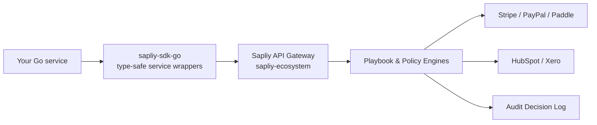

```
███████╗ █████╗ ██████╗ ██╗     ██╗   ██╗ ██╗   ██╗
██╔════╝██╔══██╗██╔══██╗██║     ██║   ██║ ╚██╗ ██╔╝
███████╗███████║██████╔╝██║     ██║   ██║  ╚████╔╝
╚════██║██╔══██║██╔══██╗██║     ██║   ██║   ╚██╔╝
███████║██║  ██║██║  ██║███████╗╚██████╔╝    ██║
╚══════╝╚═╝  ╚═╝╚═╝  ╚═╝╚══════╝ ╚═════╝     ╚═╝
```

# Sapliy Go SDK

Official Go client for the Sapliy AI-Native Financial Operations Platform.

> **Sapliy is an AI-native Financial Operations Intelligence Layer that turns business goals into reliable, explainable, auditable financial outcomes — by orchestrating the systems companies already run (Stripe, PayPal, Paddle, HubSpot, Xero), not replacing them.**

| Badge | |
|---|---|
| Package | [`github.com/sapliy/sapliy-sdk-go`](https://pkg.go.dev/github.com/sapliy/sapliy-sdk-go) |
| Version | `v1.0.0` |
| License | [](https://opensource.org/licenses/MIT) |
| Build | [](https://pkg.go.dev/github.com/sapliy/sapliy-sdk-go) |
| Go | `1.25.6` |

---

## What is this?

The **official Go SDK** for the Sapliy core backend (`sapliy-ecosystem`). It wraps the generated OpenAPI client in type-safe, idiomatic Go service structs so you can build financial automation directly against payments, wallets, ledger, billing, zones, events — and the MVP **Operational Playbook catalog** — without hand-rolling HTTP.

Like every Sapliy SDK, it sits *on top of* the systems you already run: it orchestrates and audits, it never replaces your payment stack.

## Key features

- **Payments** — create, fetch, and confirm payment intents
- **Wallets** — read balances, top up, and transfer funds
- **Ledger** — double-entry bookkeeping: accounts and transactions
- **Billing** — subscriptions and recurring billing
- **Zones** — test/live environment isolation
- **Events** — emit, replay, and list past events (drives the MVP Operational Playbooks)
- **Flows & Executions** — manage automation flows and resume paused executions
- **Playbooks** — first-class access to the MVP playbook catalog (`revenue-recovery`, `refund-approval`, `invoice-reminders`)
- **Fixed-point money** — all amounts are `int64` cents, never floats
- **Context-aware** — every call takes a `context.Context` for cancellation and timeouts

## Install

```bash
go get github.com/sapliy/sapliy-sdk-go
```

## Quickstart

```go
package main

import (
    "context"
    "fmt"
    "log"

    sapliy "github.com/sapliy/sapliy-sdk-go"
)

func main() {
    client := sapliy.NewClient("sk_test_...")

    // Create a payment intent (amount in int64 cents)
    intent, err := client.Payments.CreateIntent(
        context.Background(), "zone_test_1", 2000, "USD", "Order #1234", nil,
    )
    if err != nil {
        log.Fatal(err)
    }

    fmt.Printf("Payment intent created: %s\n", intent.GetId())

    // List the MVP Operational Playbook catalog
    for _, p := range client.Playbooks.List() {
        fmt.Printf("- %s: %s\n", p.Type, p.Description)
    }

    // Bootstrap a scaffold config for a playbook
    cfg, err := client.Playbooks.Bootstrap("revenue-recovery")
    if err != nil {
        log.Fatal(err)
    }
    fmt.Printf("Bootstrapped: %s (%s)\n", cfg.Type, cfg.Description)
}
```

> The default base URL is `http://localhost:8080` — point it at a real gateway with `WithBaseURL` (below).

## Configuration

```go
// Custom base URL (for self-hosted)
client := sapliy.NewClient("sk_test_...", sapliy.WithBaseURL("https://api.sapliy.io"))

// Custom HTTP client
client := sapliy.NewClient("sk_test_...", sapliy.WithHTTPClient(&http.Client{
    Timeout: 30 * time.Second,
}))

// Or a simple timeout
client := sapliy.NewClient("sk_test_...", sapliy.WithTimeout(30*time.Second))
```

## API overview

### Payments

```go
intent, err := client.Payments.CreateIntent(ctx, zoneID, 1000, "USD", "Coffee", nil)
intent, err = client.Payments.GetIntent(ctx, "pi_123", zoneID)
intent, err = client.Payments.ConfirmIntent(ctx, "pi_123", zoneID, "pm_123")
```

### Wallets

```go
wallet, err := client.Wallets.Get(ctx, "user_123", zoneID)
txnID, err := client.Wallets.Topup(ctx, zoneID, 1000, "USD", "ref_1")
txnID, err := client.Wallets.Transfer(ctx, zoneID, "user_456", 500, "USD", "ref_2")
```

### Ledger

```go
account, err := client.Ledger.CreateAccount(ctx, zoneID, "Merchant", "liability", "USD")
account, err = client.Ledger.GetAccount(ctx, zoneID, "acc_123")
status, err := client.Ledger.RecordTransaction(ctx, zoneID, "ref_456", "Payment received", entries)
txn, err := client.Ledger.GetTransaction(ctx, zoneID, "txn_123")
```

### Billing

```go
sub, err := client.Billing.CreateSubscription(ctx, "plan_monthly", "cust_123")
sub, err = client.Billing.GetSubscription(ctx, "sub_123")
err = client.Billing.CancelSubscription(ctx, "sub_123")
```

### Zones

```go
zoneID, err := client.Zones.Create(ctx, "org_123", "My Zone", "test", "standard")
zones, err := client.Zones.List(ctx, "org_123")
zone, err := client.Zones.Get(ctx, "zone_test_1")
```

### Events (drive playbooks)

```go
eventID, err := client.Events.Emit(ctx, "payment.failed", map[string]interface{}{"amount": 2000}, "idem-1")
eventID, err = client.Events.Replay(ctx, "evt_123", "zone_test_1")
resp, err := client.Events.ListPast(ctx, "zone_test_1", 20, 0)
```

### Flows & Executions

```go
flow, err := client.Flows.Create(ctx, flowModel)
flow, err = client.Flows.Get(ctx, "fl_123")
flows, err := client.Flows.List(ctx, "zone_test_1")
err = client.Flows.Update(ctx, "fl_123", flowModel)
err = client.Flows.Delete(ctx, "fl_123")

exec, err := client.Flows.GetExecution(ctx, "ex_123")
msg, err := client.Flows.ResumeExecution(ctx, "ex_123", map[string]interface{}{"approved": true})
```

### Playbooks

```go
playbooks := client.Playbooks.List()            // []Playbook — the MVP catalog
cfg, err := client.Playbooks.Bootstrap(kind)     // *BootstrapConfig scaffold
```

### Auth

```go
valid, err := client.Auth.ValidateKey(ctx, "sk_test_...")
```

## Operational Playbooks

The SDK ships a static catalog of the three MVP playbooks — same set exposed by the backend playbook engine and the console:

| Playbook | Type | Purpose |
|---|---|---|
| Revenue Recovery & Dunning | `revenue-recovery` | Recover failed subscription payments with automated dunning and smart retries |
| Refund & Invoice Orchestration | `refund-approval` | Route refunds and invoice adjustments through the policy engine for approval |
| Invoice Reminders | `invoice-reminders` | Send automated reminders for overdue invoices |

`Playbooks.List()` returns the catalog; `Playbooks.Bootstrap(kind)` returns a scaffold configuration you can fill in before kicking off a playbook run.

## Architecture / how it works



The SDK never talks to providers directly — it drives the Sapliy gateway, which orchestrates the systems you already run and records every decision in the immutable audit log.

## Error handling

```go
intent, err := client.Payments.GetIntent(ctx, "invalid_id", zoneID)
if err != nil {
    // err contains: "Financial Automation API Error (404): ..."
    log.Printf("Error: %v", err)
}
```

## Context support

All methods accept a `context.Context` for cancellation and timeouts:

```go
ctx, cancel := context.WithTimeout(context.Background(), 5*time.Second)
defer cancel()

intent, err := client.Payments.CreateIntent(ctx, zoneID, 2000, "USD", "demo", nil)
```

## Development

```bash
make build    # go build ./...
make test     # go test -v ./...
make lint     # go vet ./...
```

## Examples

See the [`examples/`](examples/) directory for automation and payouts walkthroughs (zones → payment intents → events).

## Part of the Sapliy platform

- [`sapliy-ecosystem`](https://github.com/Sapliy/sapliy-ecosystem) — core backend, playbook engine, policy & audit engines
- [`sapliy-sdk-node`](https://github.com/Sapliy/sapliy-sdk-node) — Node.js SDK (`@sapliyio/fintech`)
- [`sapliy-sdk-python`](https://github.com/Sapliy/sapliy-sdk-python) — Python SDK (`sapliyio-fintech`)
- [`sapliy-examples`](https://github.com/Sapliy/sapliy-examples) — sample apps per language
- Docs — [docs.sapliy.io](https://docs.sapliy.io)

## License

MIT © [Sapliy](https://github.com/sapliy)